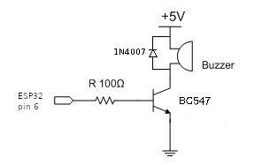
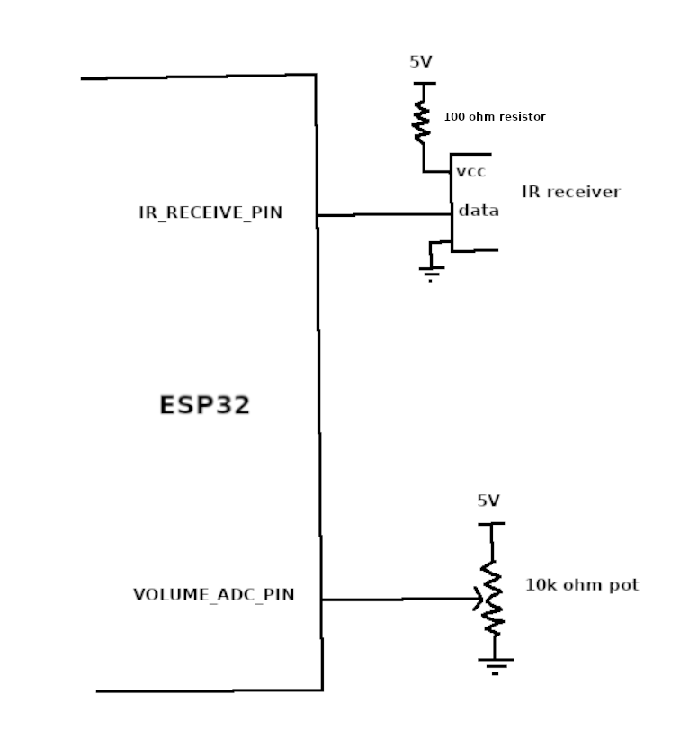

# Wireless PC macropad

The project implements wireless macro keyboard. For wireless connectivity [ESP-NOW](https://www.espressif.com/en/solutions/low-power-solutions/esp-now) communication protocol is used and not bluetooth or Wi-Fi. So you don't need Wi-Fi router or Bluetooth dongle.

Two small size [ESP-32](https://en.wikipedia.org/wiki/ESP32) microcontrollers dev boards have been used. ESP-32 has builtin wireless capabilities. One acts as USB dongle to be connected to PC. And the other as wireless macropad.

## 1. Required components

1. Two mini ESP-32 microcontrollers. Buy two of any of the following or buy one of each of the following:
    - [Waveshare ESP32-C3 Mini Development Board](https://www.waveshare.com/product/esp32-c3-zero.htm) ($4).
    - Any [ESP32 dev board with a lot of IO pins](https://www.waveshare.com/product/esp32-c6-dev-kit-n8.htm) ($7).
2. [IR Remote Control Sensor Module](https://www.amazon.com/Alinan-Infrared-Control-Controller-Receiver/dp/B0C4XRW4SX/). In this project, for keypad I am using IR remote. You can use touch key pad (TTP229) or 4x4 key module instead
3. 10k ohm potentiometer with knob.

### 1.1 Optional components

- For key press feedback
    1. 5v active buzzer
    2. BC547 NPN transistor
    3. Two 100 ohm resistors
    4. 1N4007 diode
- For ESP-NOW connectivity indicator
    1. 3mm Blue LED
    2. 1k resistor
- To power keyboard part tpe-c USB power cable, 5v power bank, or 18650 batteries with LM7805 LDO.

### 1.2 Tools

It is assumed you already have following tools:

1. Soldering tools, soldering iron etc.
2. Type-c male USB data cable
3. NodeJS installed
4. [Arduino IDE with ESP32 setup](https://youtu.be/5av6IJU5JJA?si=dueA-ef7BeHINr60)

## 2. Assembling components

### 2.1 PC dongle

Solder the buzzer to GPIO pin 6 as follows:



### 2.2 Wireless macropad

Solder IR receiver and potentiometer as to other ESP32 follows:



You can power the device using USB type-c power cable or 5V 18650 batteries module.

## 3. Programming components

### 3.1 Programming PC dongle

The dongle ESP32 is connected to PC over USB serial port. It receives commands over esp-now wifi protocol from other ESP32 macro boards. Received commands are sent to [pc-serial-macro-server](./pc-serial-macro-server/commands/) over the serial port.
The receiver dongle also receives commands from PC to be executed on its GPIO pins. You can achieve other automation using GPIO pins on the dongle ESP32 :nerd:. For example, you could drive a relay to run electrical appliances. For now the code uses commands to make sounds on buzzer module.

First we need to find MAC address of the dongle ESP32 device. At the end of [esp-now-usb-pc-dongle.ino](esp-code/esp-now-usb-pc-dongle.ino) file there is commented code that prints MAC address. Upload the code to the dongle ESP32 and note down the MAC address. The macropad will send user button presses to the dongle on this MAC address.

If required update the `esp-now-usb-pc-dongle.ino` file as per your ESP32 dev board then upload the code to the dongle ESP32.

Connect the dongle to an USB port where you are going connect it permanently. Note down the COM/USB port, e.g `COM6` on Windows and `/dev/ttyUSB0` on Linux.

### 3.2 PC macro server

Open [pc-serial-macro-server](./pc-serial-macro-server) directory in command prompt. Run following command:

```bash
npm install
```

Depending on your OS edit `pc-serial-macro-server/scripts/start-serial-macro-server.bat|sh` script.\
On Windows add it to [Task Scheduler](https://youtu.be/lzy8KNnqV0I?si=58zkq5Cn4WcQVl-c) to run it on user login.\
On Linux add command shortcut in `.bashrc` to run the shell script. After login run the shell script to start the NodeJS server.

Run the server using the script file or following command:

```bash
node index.js <dongle com/usb port>
```

### 3.3 Programming wireless macropad

Edit [esp-now-ender-macropad.ino](esp-code/esp-now-sender-macropad.ino) file as per your device and update the pin numbers. Update MAC address of the dongle ESP32. Upload the code to the macropad ESP32.

## 4. Writing macros

Connect the dongle to PC. Then start the PC macro server. Power the wireless macropad.

Now monitor the PC macro server logs. Press all the keys on the remote control one by one and note down the key codes. Also, get the MAC address from the logs and update it in `pc-serial-macro-server/index.mjs` file (update `trustedDevices` variable).

Edit `pc-serial-macro-server/commands/linux.json` or `window.json` and update key codes as you like. Don't touch `set_volume` key. Restart the PC macro server.

Restart the PC macro server to make changes live.

## See also

Other similar projects:

- [Bluetooth based macropad](https://github.com/OnkarRuikar/bt-macro-remote)
- [Wi-Fi based macropad](https://github.com/OnkarRuikar/wifi-macroboard)
